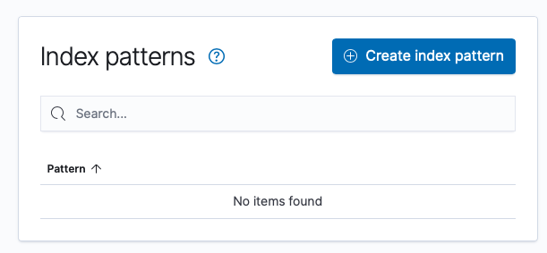
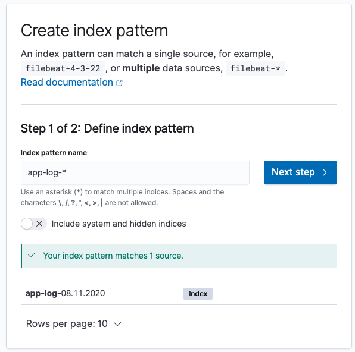
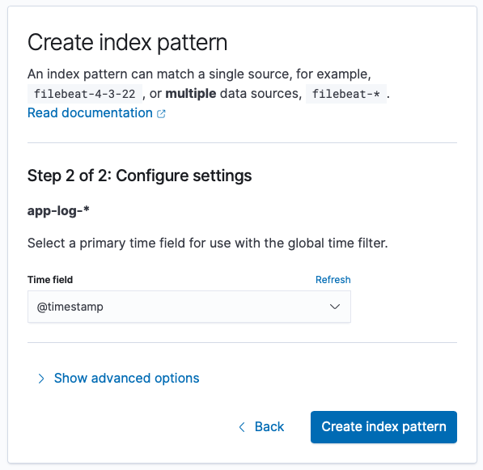

# Spring Boot and Elastic Stack
Playing around with the Elastic Stack by importing the logs of a Spring Boot application.

## Run the app and the Elastic Stack
```docker-compose up -d --build```

## Access the application
Go to [localhost:8080](http://localhost:8080) to create some logs.

## Access Kibana discovery to see logs
You can access the Kibana application on [localhost:5601/app/discover/](http://localhost:5601/app/discover/)

Before you can see the logs you will need to create an index pattern:





## Clean up
```docker-compse down -v```
